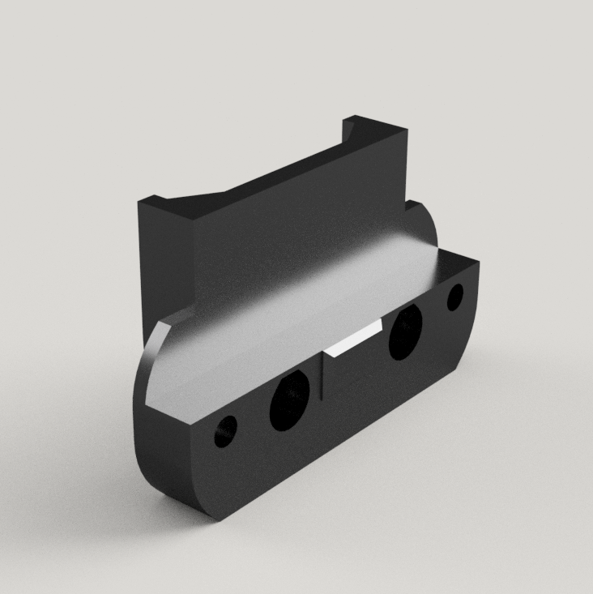

--------------------------------------------------------------------------------
BTT SMART FILAMENT SENSOR VORON PANEL MOUNT
--------------------------------------------------------------------------------
3mm BTT Smart Filament Sensor Mount

	
	

6mm BTT Smart Filament Sensor Mount

	
	

--------------------------------------------------------------------------------
SLICER SETTINGS
--------------------------------------------------------------------------------
- 4 Perimeters
- 40% Infill

--------------------------------------------------------------------------------
DISCLAIMER
--------------------------------------------------------------------------------
You are responsable for your own actions.

--------------------------------------------------------------------------------
CREDIT WHERE CREDIT IS DUE
--------------------------------------------------------------------------------
I am unsure of the original designer of this part.  If you know, let me know.

--------------------------------------------------------------------------------
BILL OF MATERIAL
--------------------------------------------------------------------------------
- 7g of Filament
- 2 M3x10mm SHCS for attaching the mount to the sensor
- 2 M3x6mm SHCS for attaching the mount to the frame
- 2 M3 T-nut 