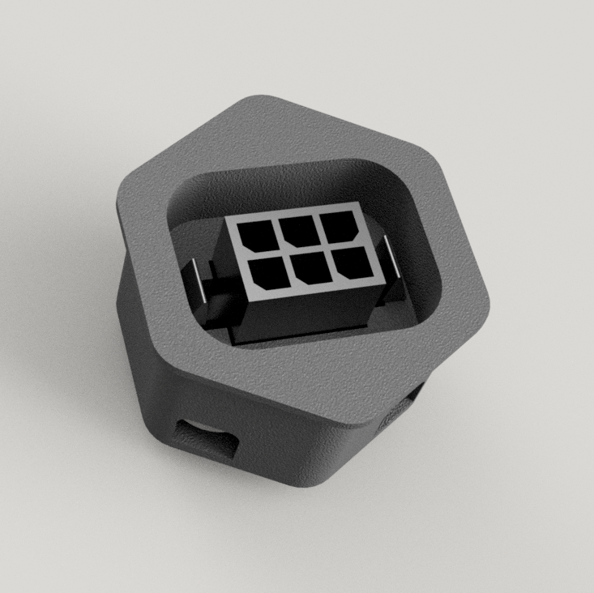
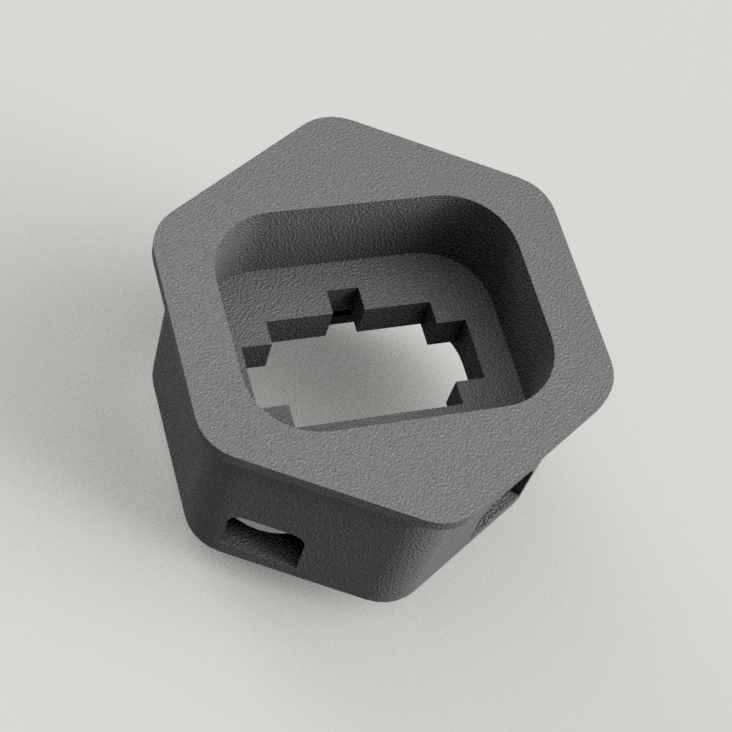

--------------------------------------------------------------------------------
INPUT SHAPER SKIRT CONNECTOR
--------------------------------------------------------------------------------

	
	

--------------------------------------------------------------------------------
SLICER SETTINGS
--------------------------------------------------------------------------------
- 4 Perimeters
- 40% Infill
- Supports are needed to support the panel mount

--------------------------------------------------------------------------------
DISCLAIMER
--------------------------------------------------------------------------------
This is currently untested.  I am still waiting for parts to test the fit and function of this part.

--------------------------------------------------------------------------------
CREDIT WHERE CREDIT IS DUE
--------------------------------------------------------------------------------
The outer housing and lock are a modification of [meteyou's gcode_buttons mod](https://github.com/VoronDesign/VoronUsers/tree/6276301a56bc56613037522765a65a276ac625d4/legacy_printers/printer_mods/meteyou/gcode_buttons)

--------------------------------------------------------------------------------
BILL OF MATERIAL
--------------------------------------------------------------------------------
- Roughly 4g of filament
- 6 Pin MicroFit3 Molex Panel Mount Connector (Molex Part #0430200608)
- 6 Pin MicroFit3 Molex Recptacle (Molex Part #0430250600)